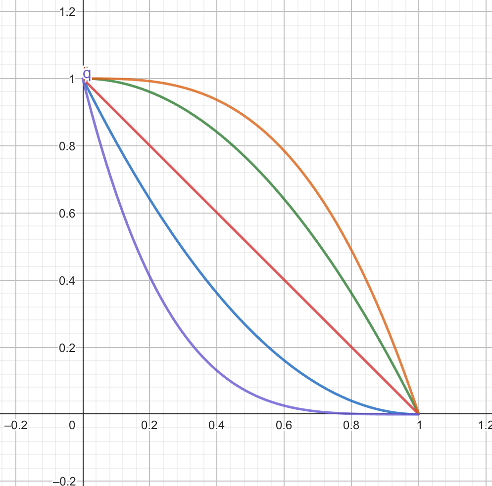
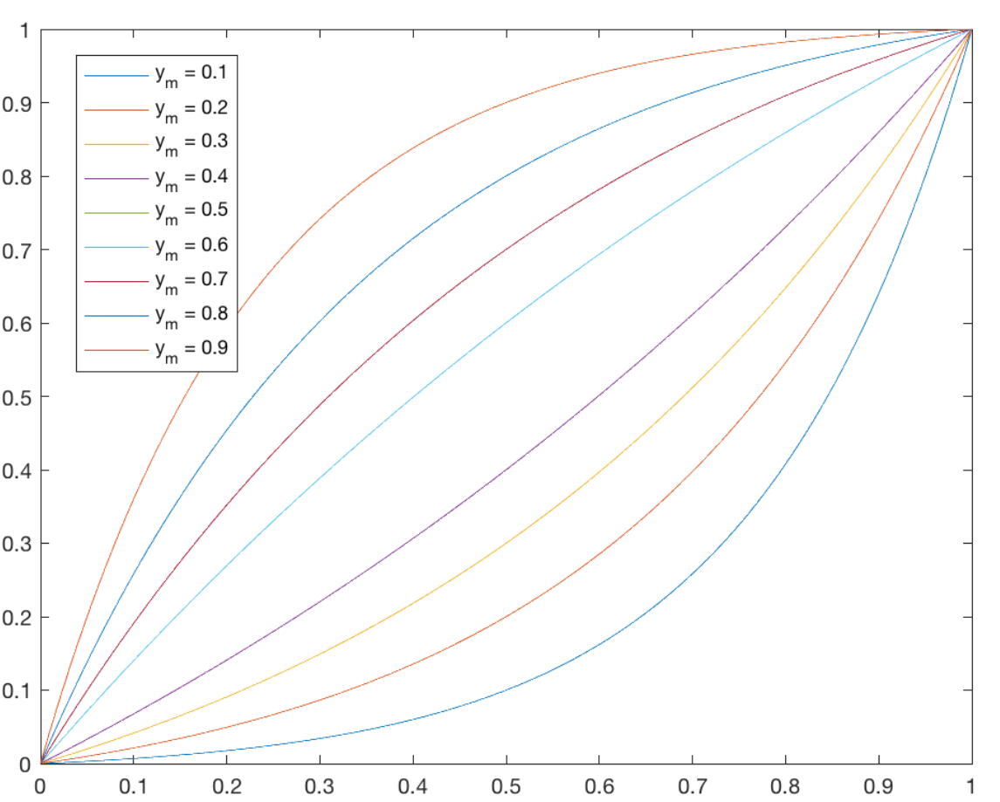

# Discover V2

## Setup

Place the symlink to the dataset in `/public/`, with the name `sample`.

Place a cover image in `/public/{name_of_image}.jpg`.

Place the json data in `/src/assets/{name_of_data}.json`.

Edit line 9 to 11 in `/src/main.js` to reflect the name of the image and data.

## Project Setup

(Tested with Node 20)

```sh
npm install
```

### Compile and Hot-Reload for Development

```sh
npm run dev
```

## Roll-off modes

Graph of the gain based on the distance from the center of the audio listener (0 is the center, 1 is the edges).


- Purple: Inverse Power Three
- Blue: Inverse Square
- Red: Linear
- Green: Square
- Yellow: Power Three

Log Tapper based on https://electronics.stackexchange.com/a/341052


